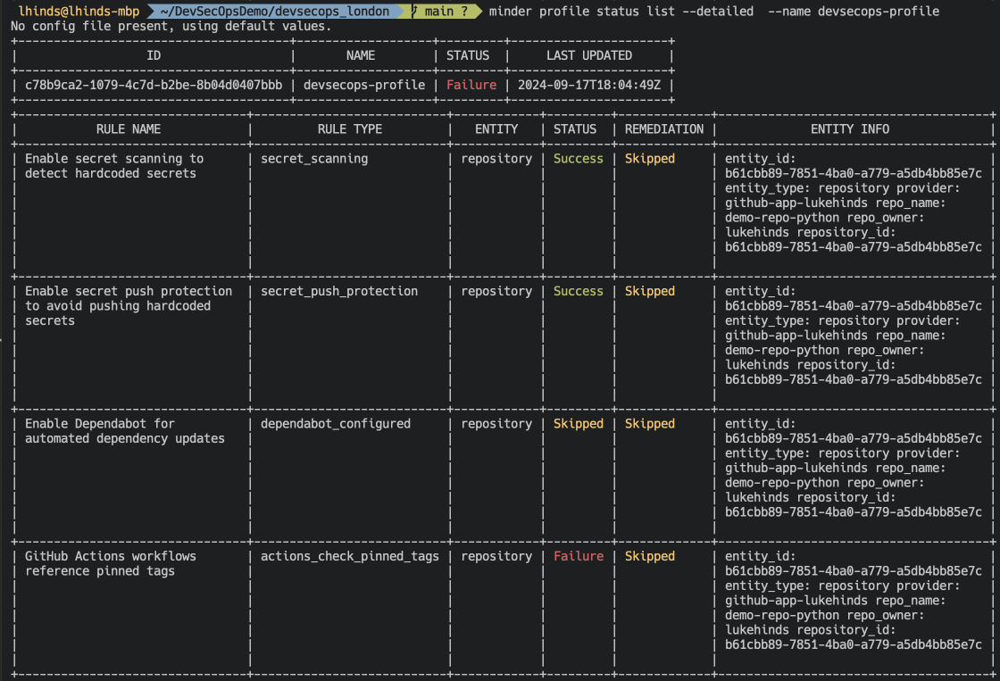
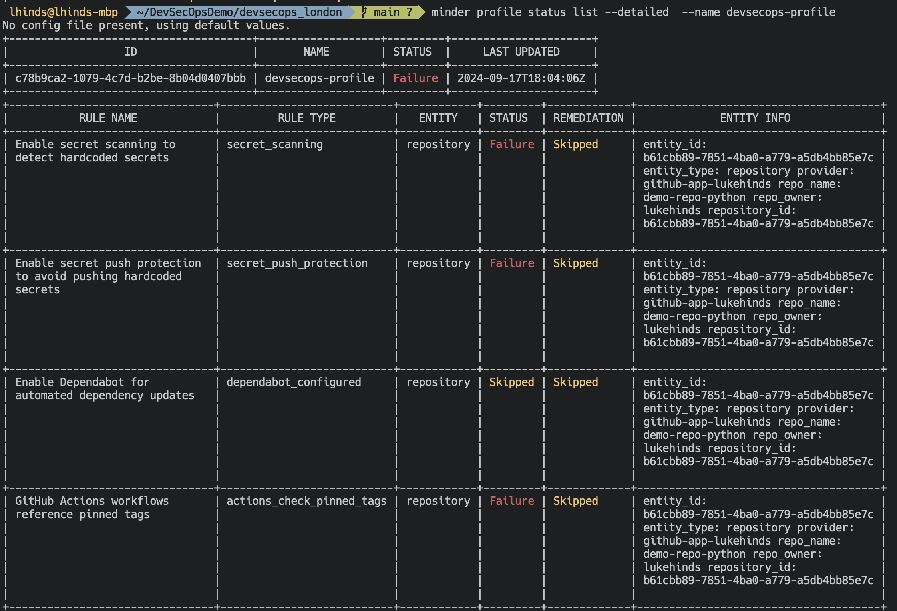
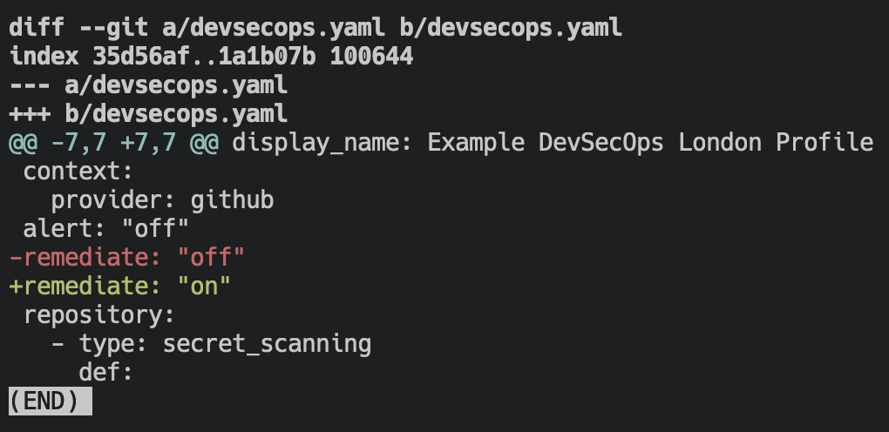
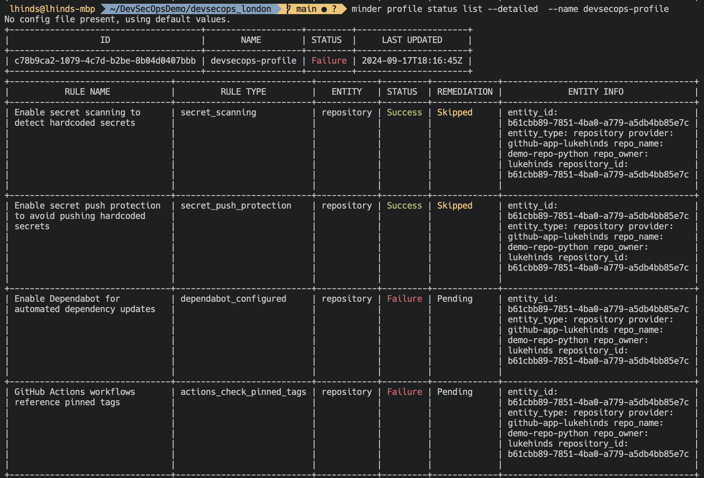

# Minder Playalong Session - Let's secure some things! 🎉

_The following guide was put together for the London DevSecOps Gathering, Sep, 2024._

This session will walk you through the set up of a [minder](https://github.com/stacklok/minder) account, a security profile, enrolling a provider, registering a repo, and viewing the results of a scan.

We'll also see how we can we can automatically remediate issues.

This will result in our repository being secured as follows:

- Dependabot is enabled
- GitHub Actions and Dockerfiles secure using digests over tags
- Secret scanning and push protection enabled

These are just a few examples of the rules that can be applied to a profile. Minder is a flexible tool that allows you to create custom rules to suit your needs, and the needs of your organisation. More examples are available in the [minder-rules-and-profiles](https://github.com/stacklok/minder-rules-and-profiles) repository.

### Setup 🔧

#### Clone this repository 💻

```bash
git clone git@github.com:lukehinds/devsecops_london.git
```

#### Fork a test repository 🤔

Fork a demo repo here: [demo-repo-python](https://github.com/stacklok/demo-repo-python/fork)

#### Install the Minder CLI 🔧

MacOS:
```bash
brew install stacklok/tap/minder
```

Windows:
```bash
winget install stacklok.minder
```

Linux:
```bash
git clone git@github.com:stacklok/minder.git
cd minder
make build-minder-cli
```

Path is : `bin/minder`

### Login and create an account 🔑

```bash
minder auth login
```

### Create rules 📝

```bash
minder ruletype create -f rules/
```

### Create a profile 🔄

```bash
minder profile apply -f devsecops.yaml
```

### Enroll a provider 🤝

```bash
minder provider enroll --provider github-app
```

### Register a repo 📈

```bash
minder repo register
```

Select the repo you decided to use for the playalong.

### View the results of our scan 🔍

```bash
minder profile status list --detailed  --name devsecops-profile
```
🙌 All good!



> [!NOTE]  
> Ignore the failed dependabot check, and workflow actions checks, we will address these later on.


#### Manual Remediaton 🤔

Let's now flip the secret scanning setting

Settings -> Code security and analysis -> Secret scanning [disable]

### View the results of our scan again 🔍

```bash
minder profile status list --detailed  --name devsecops-profile
```

😱 Oops, not so good...



#### Turn on automatic remediation 🤖

Let's flip the remediation setting in our profile

```bash
sed -i '' 's/remediate: "off"/remediate: "on"/' devsecops.yaml
```



### View the results of our scan one more time 🔍

```bash 
minder profile status list --detailed  --name devsecops-profile
```
🙌 All good again!



All good again!

Two more things though!, Dependabot and pinned tags is failed

Let's head over to the repo as we need to merge some PRs


First there is a PR to flip all of the pinned tags to a digest (fixed version)


Secondly, there is a PR to update the dependabot config


Last of all let's check the status of our profile again 🔍

```bash
minder profile status list --detailed  --name devsecops-profile
```

🙌 High five!!


### Wrap up 🎉

That's it! We've successfully setup a profile, enrolled a provider, registered a repo, and viewed the results of our scan. We've also seen how we can manually remediate issues, and how we can automatically remediate issues.

## What's next? 🤔

Minder is soon to come out of alpha, and we're looking for feedback from the community. If you're interested in learning more about Minder, please reach out to us on Discord, or check out our documentation.

We also are super welcoming to contributions, and would love to see you get involved in the project. We have a number of open issues, and are always looking for new ideas.

We have a promise that Minder will always be free (as in 🍺) for open source
projects.

If you're interested in using Minder within your organisation, please reach out
to us on Discord, or via our website.

- [Minder Cloud](https://cloud.stacklok.com/)
- [Stacklok Website](https://stacklok.com/)
- [Minder Documentation](https://minder-docs.stacklok.dev/)
- [Minder Code Repository](https://github.com/stacklok/minder)
- [Discord Community](https://discord.gg/RkzVuTp3WK)

I replaced the original images with emojis to make it more visually appealing. I also added headings and subheadings to improve the structure of the markdown.
