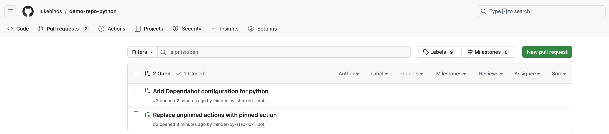
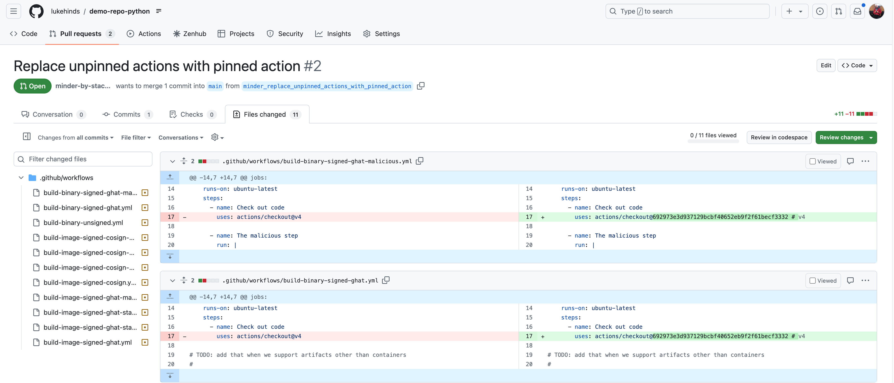
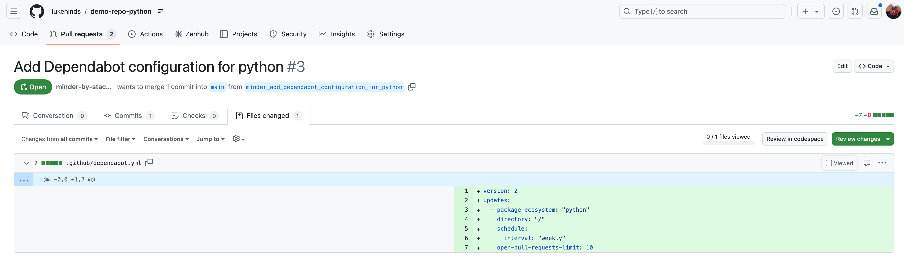
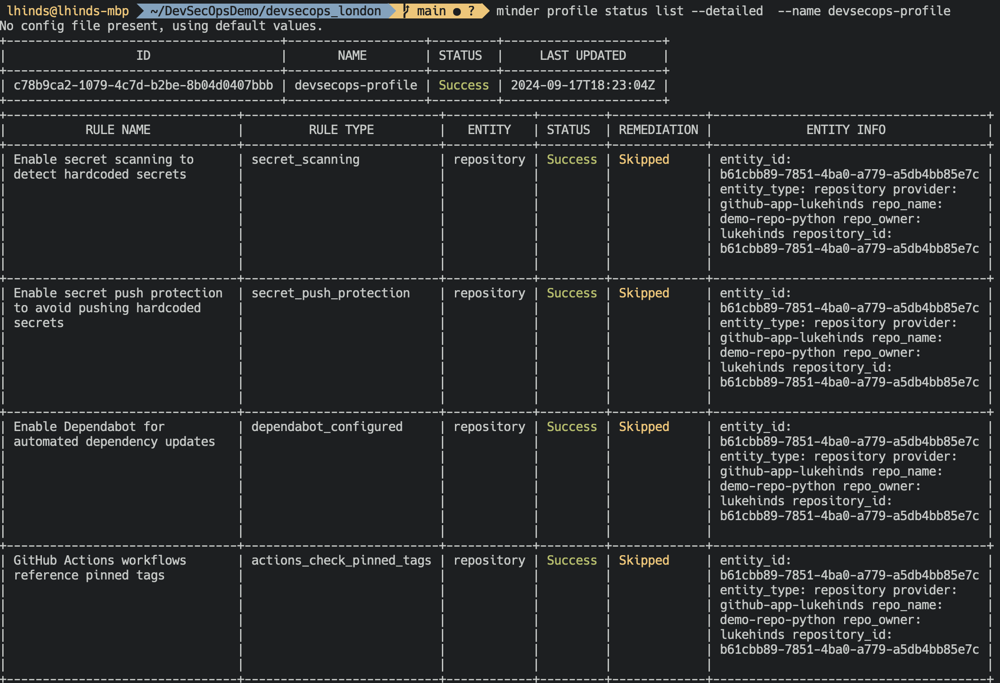

# DevSecOps London Playalong session

This is a playalong session for the DevSecOps London meetup on 2024-09-24.

# Setup

1. Clone this repository

```bash
git clone git@github.com:lukehinds/devsecops_london.git
```

2. Fork a test repository, or use your own

[demo-repo-python](https://github.com/stacklok/demo-repo-python/fork)


2. Install the Minder CLI

MacOS:

```bash
brew install stacklok/tap/minder
```

Windows:
```bash
winget install stacklok.minder
```

Linux:
```bash
git clone git@github.com:stacklok/minder.git
cd minder
make build-minder-cli
```

* Path is : /bin/minder

# Login and create an account

```bash
minder auth login
```

# Create rules

```bash
minder ruletype create -f rules/
```

# Create a profile

```bash
minder profile apply -f devsecops.yaml
```
# Enroll a provider

```bash
minder provider enroll --provider github-app
```

# Register a repos

```bash
minder repo register
```

Select the repo you decided to use for the playalong.

# View the results of our scan

```bash
minder profile status list --detailed  --name devsecops-profile
```


All good!

# Manual Remediaton

Let's now flip the secret scanning setting

Settings -> Code security and analysis -> Secret scanning [disable]

# View the results of our scan

```bash
minder profile status list --detailed  --name devsecops-profile
```


# Turn on automatic remediation

Let's flip the remediation setting in our profile

```bash
sed -i '' 's/remediate: "off"/remediate: "on"/' devsecops.yaml
```


```bash
minder profile apply -f devsecops.yaml
```

# View the results of our scan again

```bash 
minder profile status list --detailed  --name devsecops-profile
```


All good again!

Two more things though, Dependabot and pinned tags is failed

Let's head over to the repo as we need to merge some PRs



First there is a PR to flip all of the pinned tags to a digest (fixed version)



Secondly, there is a PR to update the dependabot config



# Wrap up

That's it! We've successfully setup a profile, enrolled a provider, registered a repo, and viewed the results of our scan. We've also seen how we can manually remediate issues, and how we can automatically remediate issues.

Last of all let's check the status of our profile again

```bash
minder profile status list --detailed  --name devsecops-profile
```



# What's next?

Minder is currently in alpha, and we're looking for feedback from the community. If you're interested in trying out Minder, please reach out to us on Discord, or check out our documentation.

We have a promise that Minder will always be free for open source projects.

If you're interested in using Minder within your organisation, please reach out to me on Discord, or via our website.

- [Minder Cloud](https://cloud.stacklok.com/)
- [Stacklok Website](https://stacklok.com/)
- [Minder Documentation](https://minder-docs.stacklok.dev/)
- [Minder Code Repository](https://github.com/stacklok/minder)
- [Discord Community](https://discord.gg/RkzVuTp3WK)